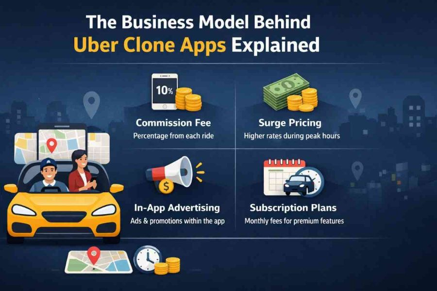

The rapid rise of on-demand services has transformed how people travel, order food, and access everyday services. Among the pioneers of this revolution, ride-hailing platforms have set the gold standard. Today, many entrepreneurs are leveraging this success by launching Uber clone apps&mdash;ready-made solutions that replicate the core features of ride-hailing platforms while allowing customization for various business needs.

Understanding the business model behind <a href="https://app-clone.com/uber-clone/"><strong>Uber clone apps</strong></a> is essential for anyone looking to enter the on-demand economy. This blog breaks down how these apps operate, generate revenue, and scale into profitable ventures.

<h2><strong>1. What is an Uber Clone App?</strong></h2>

An Uber clone app is a pre-built, customizable software solution designed to replicate the functionality of popular ride-hailing platforms. It includes essential features such as user registration, ride booking, GPS tracking, fare calculation, and payment processing.

These apps typically come with three main panels:

<ul>
<li style="font-weight: 400;"><strong>User App</strong> &ndash; For customers to book rides</li>
<li style="font-weight: 400;"><strong>Driver App</strong> &ndash; For drivers to accept and manage rides</li>
<li style="font-weight: 400;"><strong>Admin Panel</strong> &ndash; For business owners to monitor and control operations</li>
</ul>

This ready-to-launch model allows entrepreneurs to enter the market quickly without developing an app from scratch.

<h2><strong>2. Core Components of the Business Model</strong></h2>
<h3><strong>a) Aggregator Model</strong></h3>

Uber clone apps operate on an aggregator model. This means the platform does not own vehicles but connects riders with independent drivers. The app acts as a middleman, facilitating the transaction and taking a commission.

<h3><strong>b) On-Demand Service</strong></h3>

The entire model is built around instant service delivery. Customers can request rides anytime, and nearby drivers are notified immediately. This convenience is a key driver of user adoption.

<h3><strong>c) Two-Sided Marketplace</strong></h3>

The platform serves two audiences:

<ul>
<li style="font-weight: 400;">Riders seeking transportation</li>
<li style="font-weight: 400;">Drivers looking to earn income</li>
</ul>

Balancing both sides is crucial for the success of the business.

<h2><strong>3. Revenue Streams of Uber Clone Apps</strong></h2>

One of the most attractive aspects of Uber clone apps is their diverse revenue generation model.

<h3><strong>a) Commission on Rides</strong></h3>

The primary revenue source is a commission charged on every completed ride. Typically, this ranges between 15% to 30% of the total fare.

<h3><strong>b) Surge Pricing</strong></h3>

During peak hours or high demand, the app increases fares using surge pricing. This not only boosts revenue but also encourages more drivers to become active.

<h3><strong>c) Cancellation Fees</strong></h3>

If a user cancels a ride after a certain time, a cancellation fee is charged, contributing to additional revenue.

<h3><strong>d) Subscription Plans for Drivers</strong></h3>

Some platforms offer subscription-based models where drivers pay a fixed fee to access the platform instead of paying per ride commission.

<h3><strong>e) In-App Advertisements</strong></h3>

Businesses can advertise within the app, creating another revenue stream.

<h3><strong>f) Premium Services</strong></h3>

Offering luxury rides, car rentals, or outstation trips allows platforms to charge higher fares.

<h2><strong>4. Cost Structure of the Business</strong></h2>

While the revenue potential is significant, understanding the cost structure is equally important.

<h3><strong>a) App Development or Purchase</strong></h3>

Although Uber clone apps are cost-effective compared to custom development, there is still an initial investment required.

<h3><strong>b) Maintenance and Updates</strong></h3>

Regular updates, bug fixes, and feature enhancements are necessary to stay competitive.

<h3><strong>c) Marketing and User Acquisition</strong></h3>

Promotions, discounts, and advertising campaigns are essential to attract users and drivers.

<h3><strong>d) Driver Incentives</strong></h3>

To maintain a strong driver base, platforms often provide bonuses and incentives.

<h3><strong>e) Payment Gateway Fees</strong></h3>

Processing online payments involves transaction fees.

<h2><strong>5. Key Features That Drive the Business Model</strong></h2>
<h3><strong>a) Real-Time GPS Tracking</strong></h3>

Allows users to track drivers and ensures transparency.

<h3><strong>b) Automated Fare Calculation</strong></h3>

Eliminates manual errors and ensures accurate pricing.

<h3><strong>c) Multiple Payment Options</strong></h3>

Supports cash, credit cards, wallets, and digital payments.

<h3><strong>d) Ratings and Reviews</strong></h3>

Builds trust and ensures quality service.

<h3><strong>e) Ride Scheduling</strong></h3>

Allows users to book rides in advance.

<h2><strong>6. Scaling Opportunities</strong></h2>

Uber clone apps are not limited to ride-hailing. Entrepreneurs can expand into multiple services.

<h3><strong>a) Multi-Service Integration</strong></h3>

You can integrate services like:

<ul>
<li style="font-weight: 400;">Food delivery</li>
<li style="font-weight: 400;">Grocery delivery</li>
<li style="font-weight: 400;">Medicine delivery</li>
<li style="font-weight: 400;">Parcel delivery</li>
</ul>

This transforms the app into a super app, increasing revenue streams.

<h3><strong>b) Geographic Expansion</strong></h3>

Start in a single city and gradually expand to multiple locations.

<h3><strong>c) Corporate Partnerships</strong></h3>

Collaborate with businesses for employee transportation services.

<h2><strong>7. Advantages of Uber Clone Apps</strong></h2>
<h3><strong>a) Faster Time to Market</strong></h3>

Pre-built solutions reduce development time significantly.

<h3><strong>b) Cost-Effective</strong></h3>

Lower investment compared to building an app from scratch.

<h3><strong>c) Proven Business Model</strong></h3>

Based on a successful and tested concept.

<h3><strong>d) Customizable</strong></h3>

Allows businesses to tailor features according to their target audience.

<h2><strong>8. Challenges in the Business Model</strong></h2>
<h3><strong>a) High Competition</strong></h3>

The ride-hailing market is highly competitive, with many players entering the space.

<h3><strong>b) Driver Retention</strong></h3>

Keeping drivers engaged and satisfied can be challenging.

<h3><strong>c) Regulatory Issues</strong></h3>

Different regions have varying transportation laws and regulations.

<h3><strong>d) Customer Retention</strong></h3>

Offering consistent service quality is essential to retain users.

<h2><strong>9. Strategies for Success</strong></h2>
<h3><strong>a) Focus on User Experience</strong></h3>

A smooth and user-friendly interface can set your app apart.

<h3><strong>b) Competitive Pricing</strong></h3>

Offer attractive pricing without compromising profitability.

<h3><strong>c) Strong Marketing Campaigns</strong></h3>

Use digital marketing, social media, and referral programs.

<h3><strong>d) Build Trust</strong></h3>

Ensure safety features like driver verification and emergency contacts.

<h3><strong>e) Leverage Technology</strong></h3>

Use AI and data analytics to improve efficiency and customer satisfaction.

<h2><strong>10. Future Trends in Uber Clone App Business</strong></h2>
<h3><strong>a) Electric Vehicles Integration</strong></h3>

Eco-friendly transportation options are gaining popularity.

<h3><strong>b) AI-Based Ride Matching</strong></h3>

Improves efficiency and reduces waiting time.

<h3><strong>c) Autonomous Vehicles</strong></h3>

Although still evolving, this could redefine the industry.

<h3><strong>d) Super Apps</strong></h3>

Combining multiple services into one platform is becoming the norm.

<h2><strong>Conclusion</strong></h2>

The business model behind <a href="https://app-clone.com/uber-clone/"><strong>Uber clone apps</strong></a> is a powerful combination of technology, convenience, and scalability. By operating as an aggregator in a two-sided marketplace, these apps generate revenue through commissions, surge pricing, and additional services. With relatively low entry barriers and high growth potential, Uber clone apps offer an excellent opportunity for entrepreneurs to tap into the booming on-demand economy.

However, success requires more than just launching an app. Strategic planning, effective marketing, and continuous innovation are essential to stand out in a competitive market. By understanding the core mechanics of the business model and adapting to market trends, you can build a sustainable and profitable Uber clone app business.

<h2><strong>FAQs</strong></h2>
<h3><strong>1. What is the main revenue source of Uber clone apps?</strong></h3>

The primary revenue source is the commission charged on each ride, typically ranging from 15% to 30%.

<h3><strong>2. How much does it cost to launch an Uber clone app?</strong></h3>

The cost varies depending on features and customization but is significantly lower than developing an app from scratch.

<h3><strong>3. Can I customize an Uber clone app for other services?</strong></h3>

Yes, Uber clone apps can be customized to include services like food delivery, grocery delivery, and more.

<h3><strong>4. How do Uber clone apps attract drivers?</strong></h3>

They offer incentives, flexible working hours, and earning opportunities to attract and retain drivers.

<h3><strong>5. Is the Uber clone app business profitable?</strong></h3>

Yes, with the right strategy, market research, and execution, it can be highly profitable due to multiple revenue streams and scalability.

